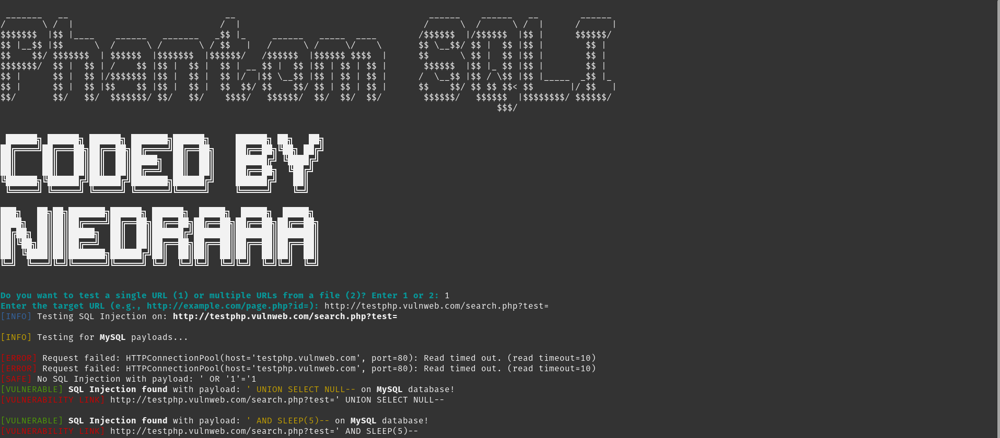

# Phantom_SQLI


**Phantom_SQLI** est l'outil le plus puissant pour les injections SQL automatiques ! 🚀

Ce logiciel est conçu pour détecter les vulnérabilités SQLi de manière efficace et rapide. En plus de détecter les failles, **Phantom_SQLI** peut également découvrir certaines informations sur les bases de données ciblées. Tous les payloads utilisés pour les tests sont pré-enregistrés pour garantir une efficacité optimale.

> **Phantom_SQLI** doit être utilisé à bon escient et uniquement dans des environnements de test ou avec la permission explicite des propriétaires des sites ciblés. L'utilisation abusive de cet outil peut être illégale et entraîner des conséquences graves.

## Fonctionnalités

- 🔍 **Détection automatique des vulnérabilités SQLi**
- 💾 **Découverte des informations de base de données** telles que les noms des bases, des tables et des colonnes
- 📋 **Tous les payloads pré-enregistrés** pour une détection rapide et efficace
- 💻 **Interface conviviale pour une utilisation simplifiée**
- ⚡ **Rapidité et précision dans l'identification des failles**

## Installation

```bash
git clone https://github.com/votre-utilisateur/Phantom_SQLI.git
cd Phantom_SQLI
pip install -r requirements.txt
```
## Utilisation 

```bash
python3 phantom_sqli.py
```


## Soutenir le Projet

Si vous souhaitez soutenir le développement de **Phantom_SQLI**, vous pouvez me faire un don via [Buy Me a Coffee](https://buymeacoffee.com/niedraaa). Votre soutien est grandement apprécié ! ☕️

**Phantom_SQLI** est un outil puissant, et il est essentiel de l'utiliser de manière responsable pour renforcer la sécurité des systèmes et des applications. Merci pour votre soutien et votre contribution à la sécurité numérique ! 🌟


